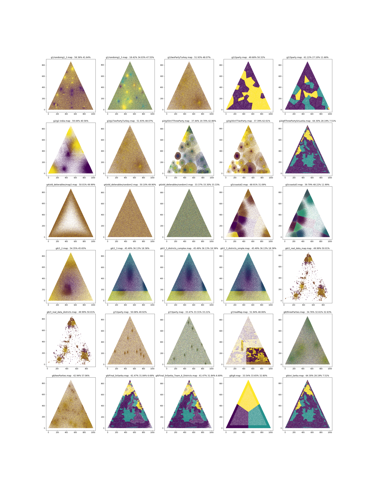

# Map statistics by party



# For two party maps

| Map file | Win rates |
| --- | --- |
|`g1/randomg1_2.map             ` | `58.36%` `41.64%` |
|`g1/twoPartyTurkey.map         ` | `51.93%` `48.07%` |
|`g2/2party.map                 ` | `49.68%` `50.32%` |
|`g2/g2-india.map               ` | `59.44%` `40.56%` |
|`g3/g1TwoPartyTurkey.map       ` | `51.93%` `48.07%` |
|`g3/g3Oct7TwoParty.map         ` | `37.39%` `62.61%` |
|`g4/old_delierables/map2.map   ` | `50.01%` `49.99%` |
|`g4/old_delierables/random2.map` | `50.10%` `49.90%` |
|`g5/coastal2.map               ` | `68.91%` `31.09%` |
|`g6/1_2.map                    ` | `54.35%` `45.65%` |
|`g6/2_real_data_map.map        ` | `49.99%` `50.01%` |
|`g6/3_real_data_districts.map  ` | `49.99%` `50.01%` |
|`g7/2party.map                 ` | `50.08%` `49.92%` |
|`g7/realMap.map                ` | `51.94%` `48.06%` |
|`g8/twoParties.map             ` | `42.94%` `57.06%` |

# For three party maps

| Map file | Win rates |
| --- | --- |
|`g1/randomg1_3.map             ` | `18.42%` `34.03%` `47.55%` |
|`g2/3party.map                 ` | `61.22%` `27.10%` `11.68%` |
|`g3/g3Oct7ThreeParty.map       ` | `37.44%` `19.70%` `42.86%` |
|`g3/g9ThreePartySriLanka.map   ` | `64.30%` `28.19%` `7.51%` |
|`g4/old_delierables/random3.map` | `33.37%` `33.30%` `33.33%` |
|`g5/coastal3.map               ` | `39.79%` `48.22%` `11.99%` |
|`g6/1_3.map                    ` | `45.49%` `36.13%` `18.38%` |
|`g6/2_3_districts_complex.map  ` | `45.49%` `36.13%` `18.38%` |
|`g6/2_3_districts_simple.map   ` | `45.49%` `36.13%` `18.38%` |
|`g7/3party.map                 ` | `33.47%` `33.31%` `33.21%` |
|`g8/threeParties.map           ` | `34.76%` `32.61%` `32.63%` |
|`g9/Final_Srilanka.map         ` | `61.47%` `31.84%` `6.69%` |
|`g9/Final_Srilanka_Team_6_DIstricts.map` | `61.47%` `31.84%` `6.69%` |
|`g9/g9.map                     ` | `33.54%` `33.65%` `32.80%` |
|`g9/sri_lanka.map              ` | `64.30%` `28.19%` `7.51%` |
|`g9/voters.map                 ` | `33.36%` `33.40%` `33.25%` |

# Code

## For statistics
```python
MAP_LIST    = map_util.list_maps()
LOADED_MAPS = [map_util.load_map(map_file) for map_file in MAP_LIST]

print("| Map file | Win rates |")
print("| --- | --- |")
for map_file, _map in zip(MAP_LIST, LOADED_MAPS):
    if _map.shape[1] != 5: continue
    win_rates = np.bincount(_map[:,2:].argmax(1)) / len(_map)
    print(f"|`{map_file[31:]:30s}` | {' '.join(map(lambda x:f'`{x:0.2f}%`', win_rates*100))} |")
```

## For visualization
```python
def visualize_map(_map, ax=None, color_scheme='argmax'):
    if ax is None:
        fig, ax = plt.subplots(1, 1, figsize=(10,10))
    
    if color_scheme == 'argmax':
        colors = np.argmax(_map[:, 2:], 1)
    else:
        colors = [tuple(dist) for dist in _map[:, 2:]]

    plot = ax.scatter(_map[:,0], _map[:,1], s=0.01, c=colors, alpha=0.5, cmap='rainbow')
    
fig, axs = plt.subplots(6, 5, figsize=(30, 40))

for _file, _map, ax in zip(MAP_LIST, LOADED_MAPS, axs.flatten()):
    win_rates = np.bincount(_map[:,2:].argmax(1)) / len(_map)
    
    ax.set_title(f"{_file[31:]} : {' '.join(map(lambda x:f'{x:0.2f}%', win_rates*100))}")
    map_util.visualize_map(_map, ax)
```